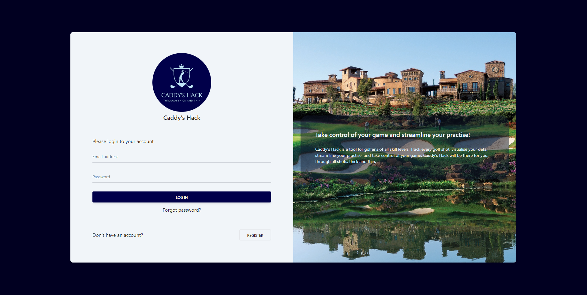
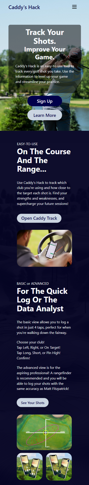
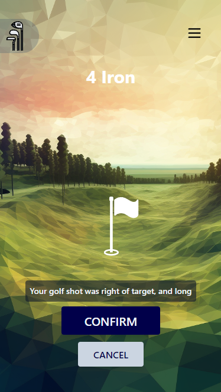

# Caddy's Hack - A Golf Shot Tracker

A Full Stack Application, made with React and TailwindCSS. The Back-End can be found [here](https://github.com/WestyCodes/caddys_hack_backEnd)

## Table of contents

-   [Caddy's Hack - A Golf Shot Tracker](#caddys-hack---a-golf-shot-tracker)
    -   [Table of contents](#table-of-contents)
    -   [General info](#general-info)
    -   [Technologies](#technologies)
    -   [Setup](#setup)
    -   [UI Screenshots](#ui-screenshots)
        -   [Desktop Screenshots of the Site](#desktop-screenshots-of-the-site)
            -   [Home Page](#home-page)
            -   [Login Page](#login-page)
            -   [Register Page](#register-page)
            -   [Tracker Page](#tracker-page)
            -   [Data Visualisation Page](#data-visualisation-page)
        -   [Mobile Screenshots](#mobile-screenshots)
            -   [Mobile Home Page](#mobile-home-page)
            -   [Mobile Login Page](#mobile-login-page)
            -   [Mobile Tracker Page](#mobile-tracker-page)

## General info

This is a solo project, with the MVP being created in just 8 days. The MVP consisted of a landing page, login and registration of new accounts, the golf shot tracker itself, and data visualisation. A fully functioning application to aid golfers with their future practise.

## Technologies

Project is created with:

-   React version: 18.2
-   NPM version: 8.19.2
-   TailwindCSS: 3.3.2

## Setup

To run this project, install it locally using npm:

```
$ cd ../caddys_hack_frontend
$ npm install
$ npm start
```

You will also need to download and install the backend which can be found [here](https://github.com/WestyCodes/caddys_hack_backEnd)

## UI Screenshots


### Desktop Screenshots of the Site

#### Home Page


#### Login Page



#### Register Page


#### Tracker Page


#### Data Visualisation Page


### Mobile Screenshots

#### Mobile Home Page



#### Mobile Login Page


#### Mobile Tracker Page


